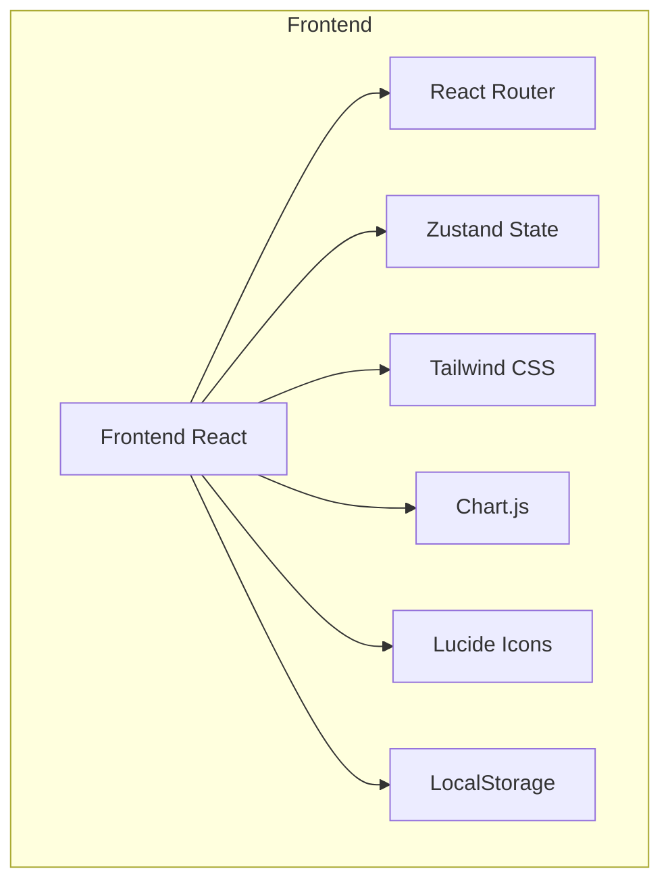
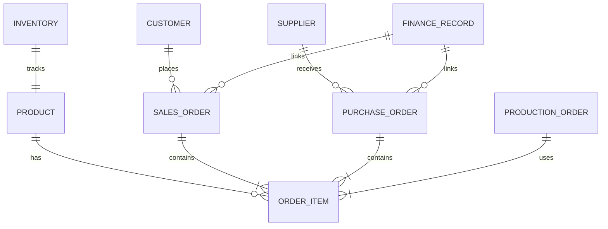

## 1. Architecture Design


## 2. Technology Description
- Frontend: React@18 + TypeScript + Tailwind CSS + Vite
- State Management: Zustand
- UI Components: Custom components with Tailwind
- Charts: Chart.js + react-chartjs-2
- Icons: lucide-react
- Data Persistence: LocalStorage (demo阶段)
- Backend: None (纯前端应用，使用模拟数据)

## 3. Route Definitions
| Route | Purpose |
|-------|---------|
| / | 首页/仪表盘 |
| /production | 生产管理 |
| /sales | 销售管理 |
| /purchase | 采购管理 |
| /inventory | 库存管理 |
| /finance | 财务管理 |
| /settings | 系统设置 |

## 4. API Definitions
不适用（纯前端应用，使用模拟数据）

## 5. Server Architecture Diagram
不适用（纯前端应用）

## 6. Data Model
### 6.1 Data Model Definition


### 6.2 Data Definition Language
使用 TypeScript 接口定义数据模型：

```typescript
// 产品
interface Product {
  id: string;
  name: string;
  sku: string;
  category: string;
  unit: string;
  price: number;
  cost: number;
}

// 库存
interface Inventory {
  id: string;
  productId: string;
  quantity: number;
  minStock: number;
  warehouse: string;
}

// 客户
interface Customer {
  id: string;
  name: string;
  contact: string;
  phone: string;
  email: string;
  address: string;
}

// 供应商
interface Supplier {
  id: string;
  name: string;
  contact: string;
  phone: string;
  email: string;
  address: string;
}

// 销售订单
interface SalesOrder {
  id: string;
  orderNo: string;
  customerId: string;
  orderDate: string;
  items: OrderItem[];
  totalAmount: number;
  status: 'pending' | 'shipped' | 'completed' | 'cancelled';
}

// 采购订单
interface PurchaseOrder {
  id: string;
  orderNo: string;
  supplierId: string;
  orderDate: string;
  items: OrderItem[];
  totalAmount: number;
  status: 'pending' | 'received' | 'completed' | 'cancelled';
}

// 生产订单
interface ProductionOrder {
  id: string;
  orderNo: string;
  productId: string;
  quantity: number;
  startDate: string;
  endDate: string;
  status: 'pending' | 'in_progress' | 'completed';
}

// 订单项
interface OrderItem {
  productId: string;
  quantity: number;
  price: number;
}

// 财务记录
interface FinanceRecord {
  id: string;
  type: 'income' | 'expense';
  category: string;
  amount: number;
  date: string;
  description: string;
  relatedOrderId?: string;
}

// 用户
interface User {
  id: string;
  username: string;
  name: string;
  role: 'admin' | 'operator' | 'viewer';
}
```
