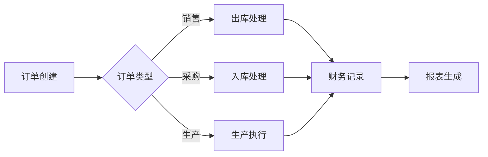

## 1. Product Overview
一款集生产、销售、采购、库存、财务于一体的现代化进销存管理系统，帮助中小型企业实现业务流程的数字化管理。
- 目标用户：中小型制造/贸易企业的管理人员和操作人员
- 市场价值：提高工作效率、降低库存成本、实现财务透明化

## 2. Core Features

### 2.1 User Roles
| Role | Registration Method | Core Permissions |
|------|---------------------|------------------|
| 管理员 | 预设账号 | 全部功能权限，用户管理 |
| 操作员 | 管理员创建 | 业务操作权限 |
| 查看员 | 管理员创建 | 只读权限 |

### 2.2 Feature Module
1. **首页/仪表盘**：数据概览、统计图表、快捷入口
2. **生产管理**：生产计划、生产订单、生产进度
3. **销售管理**：客户管理、销售订单、销售报表
4. **采购管理**：供应商管理、采购订单、采购报表
5. **库存管理**：库存查询、入库出库、库存盘点
6. **财务管理**：收支记录、财务报表、应收应付
7. **系统管理**：用户管理、权限设置、数据备份

### 2.3 Page Details
| Page Name | Module Name | Feature description |
|-----------|-------------|---------------------|
| 首页 | 仪表盘 | 显示关键指标（销售额、库存、订单数）、趋势图表、待办事项 |
| 生产管理 | 生产订单 | 创建生产订单、分配任务、跟踪进度、完成记录 |
| 销售管理 | 销售订单 | 客户选择、商品选择、订单创建、状态跟踪 |
| 采购管理 | 采购订单 | 供应商选择、商品选择、订单创建、入库跟踪 |
| 库存管理 | 库存查询 | 实时库存查询、库存预警、出入库记录 |
| 财务管理 | 收支记录 | 收入/支出录入、账户管理、财务统计 |

## 3. Core Process
主要业务流程：创建订单 → 库存处理 → 财务记录 → 报表统计

## 4. User Interface Design
### 4.1 Design Style
- 主色调：深蓝色（#1e40af）配合浅蓝（#3b82f6）作为辅助色
- 按钮风格：现代化圆角按钮，带有微妙的阴影和悬停效果
- 字体：Inter 作为主要字体，清晰易读
- 布局风格：左侧导航栏 + 顶部操作栏 + 内容区域的经典后台布局
- 图标风格：使用线性图标，简洁专业

### 4.2 Page Design Overview
| Page Name | Module Name | UI Elements |
|-----------|-------------|-------------|
| 首页 | 仪表盘 | 卡片式布局展示关键指标、Chart.js 图表、快捷操作卡片 |
| 订单页面 | 订单列表 | 表格布局、筛选栏、操作按钮、状态标签 |
| 表单页面 | 订单创建 | 分步表单、下拉选择、日期选择器、表单验证 |

### 4.3 Responsiveness
桌面端优先，支持平板设备，采用响应式布局适配不同屏幕尺寸。

### 4.4 3D Scene Guidance
不适用3D场景。
